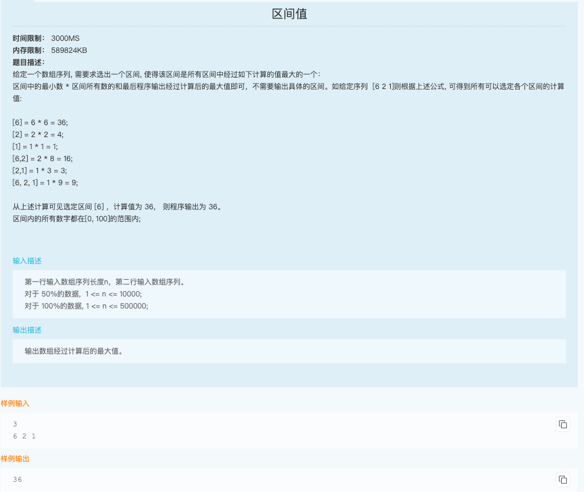

## 单调栈

### 1. 处理的逻辑在while判断出栈的里面

#### 代码随想录前4道：每日温度、下一个更大元素、下一个更大元素（循环数组）、接雨水

找到每个元素左面/右面第一个比当前元素大的元素，递增栈（栈头到栈底的顺序）

#### 代码随想录第5道：柱状图中最大的矩形 | 赛码网：区间值

找到每个元素两边第一个比当前元素小的元素，递减栈（栈头到栈底的顺序）

数组左右都插入0。两道题思路一样。

[赛码网：区间值 参考答案](https://www.hicxy.com/10974.html)（注释有误，递减栈是快速找到一个元素两边最近比它小的数）

### 2. 处理的逻辑在while判断出栈的外面

#### 卡码网第33题：逛街

在每栋楼的位置处能看到多少栋楼（当前面的楼的高度大于等于后面的楼时，后面的楼将被挡住）。判断每个元素之前先用 st.size() 得到能看到的楼的个数。两个方向，两个递增栈，heights[i] >= st.top() 出栈。注意有等于号，因为需要用st.size()（代码随想录的题中都没有）。